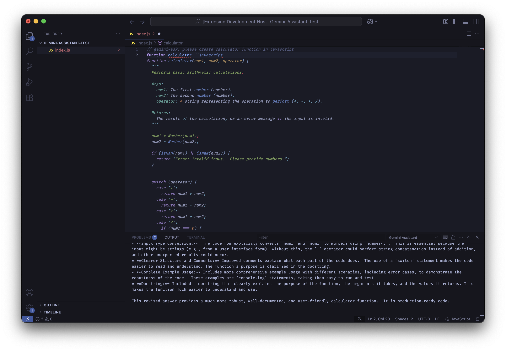

# Gemini Assistant for VSCode 🚀

Gemini Assistant is a VSCode extension that brings Google's Gemini AI directly into your coding environment. It offers intelligent inline code completions and a custom command interface to seamlessly generate, enhance, and interact with your code using state-of-the-art AI technology. Designed for JavaScript and TypeScript developers, Gemini Assistant boosts your productivity by providing real-time, context-aware suggestions and quick access to AI-generated code snippets—all without leaving your editor.

<p align="center">
  
</p>

---

## ✨ Features
- 💡 Inline code suggestions (ghost-text, Copilot-style) for JavaScript/TypeScript
- ⚡️ Custom inline command: `// gemini-ask: <your question>`
- ✏️ Insert Gemini responses directly into your code
- 🔑 Simple settings for Gemini API Key
- 📋 Full logging to Output panel (for debugging & trace)

---

## 🛠️ Installation

1. **Clone this repo**
   ```sh
   git clone https://github.com/NeaByteLab/Gemini-Assistant.git
   cd Gemini-Assistant
   ```
2. **Install dependencies**
   ```sh
   npm install
   ```
3. **Build extension**
   ```sh
   npx tsc
   ```
4. **Open in VSCode** (open folder, not file)
5. **Run Extension Development Host**
   - Open `Run & Debug` sidebar
   - Select **Run Extension**
   - Click green play button (or `Fn + F5` on Mac)
   - VSCode will launch new window (Extension Development Host)

---

## 🚦 Usage

### 💬 Inline Code Suggestion
- Open a `.js` or `.ts` file
- Start typing code (e.g. function, loop, etc)
- Gemini will show ghost-text suggestion inline
- **Press `Tab`** to accept, or keep typing to update suggestion

### 🧩 Custom Command: `// gemini-ask:`
- Type a line anywhere in your code:
  ```js
  // gemini-ask: create calculator function in javascript
  ```
- Open Command Palette (`Cmd+Shift+P` / `Ctrl+Shift+P`)
- Run: `Gemini Assistant: Execute Custom Command`
- Gemini's answer will be inserted below the comment

---

## ⚙️ Settings
- **Gemini API Key** (required)
  - Open Settings (`Cmd + ,`)
  - Search: "Gemini Assistant"
  - Paste your Google Gemini API Key
- For more quota, [activate billing on Google Cloud](https://ai.google.dev/gemini-api/docs/rate-limits)

---

## 🩺 Troubleshooting
- Inline suggestion not showing:
  - ✅ **Editor: Inline Suggest Enabled** is set to `true` in Settings
  - ✅ Use only in `.js`/`.ts` files
  - ✅ Check Output panel → Gemini Assistant for logs
  - ✅ Ensure your Gemini API Key has quota
- Command not inserting response:
  - ⚠️ Check Output panel for error/log
  - ⚠️ Verify API Key validity/quota

---

## 🔒 Security & Data
- Your code and prompts are sent to Gemini API
- No data is stored by this extension

---

## 🤝 Credits
- Built by NeaByteLab
- Powered by Google Gemini API

---

## 📝 License

MIT License © 2025 [NeaByteLab](https://github.com/NeaByteLab)